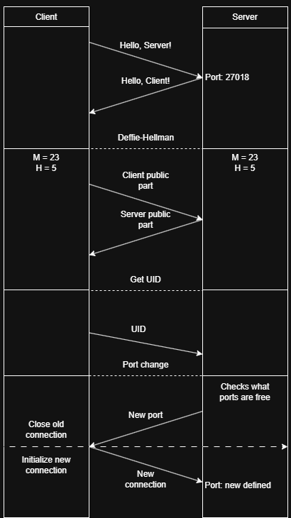

# Simple-Cpp-Multithreaded-Server
A minimal multithreaded TCP server written in C++ using POSIX sockets.  
It handles client connections through an initial handshake on a main port, then creates a dedicated listener socket for each client and serves them in a separate thread.

## Features
- Uses POSIX sockets for network communication (Linux/Unix targets)
- Main listening socket accepts client connections
- Handshake defines private key for encryption (Really simple Diffie-Hellman alg. and XOR encryption)
- Each client is handled in its own thread

## How It Works 
<table>
  <tr>
    <td style="vertical-align: top; width: 40%;">

1. The server starts and listens on a main port for incoming connections.
2. When a client connects, the server performs handshake (DH, new port and UID exchange).
3. After handshake, the server instantiates a listener socket dedicated to the client (the code spawns a new socket).
4. The server spawns a new thread to handle communication on that dedicated socket for that client.
6. The server continues accepting new clients, each handled on its own thread.
    </td>
    <td style="vertical-align: top; width: 60%;">
      
    </td>
  </tr>
</table>

> [!NOTE]
> I've written it mostly myself, just used AI in server-rewriten-clean.cpp so its readable

